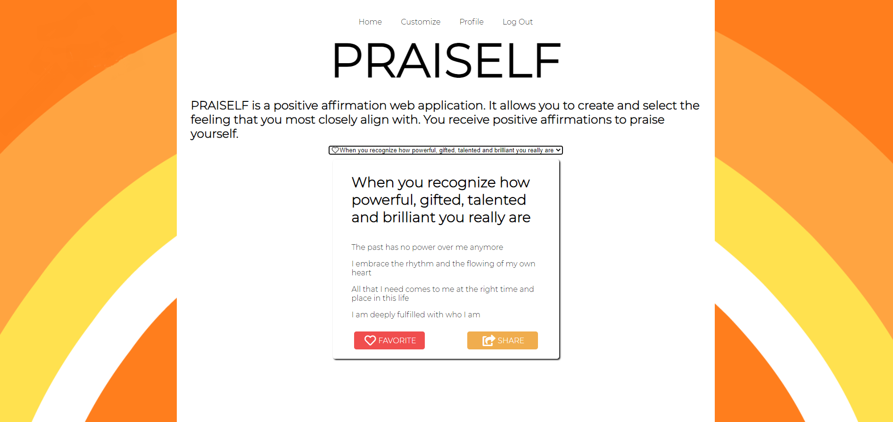

## PRAISELF

PRAISELF is a full-stack web application that can help one be more productive, by converting feelings into positive affirmations for you and your friends. When you create a login, there is also the option to customize  and add your own positive affirmations for your profile.
 
Use the drop down menu to  select the emotion you are most closely feeling, and below shows the positive affirmations you should read out loud. Please help spread positivity by adding positive affirmations to your life and sending them to friends through text and Gmail. 

## How It's Made:
Tech used: HTML, EJS, CSS, JavaScript, Node.js, Express.js, MongoDb, Twilio

Please click the link below to interact with it:
https://praiself.herokuapp.com/

